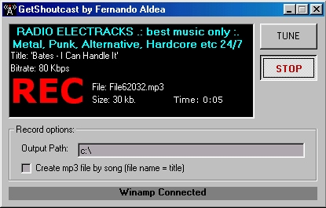

## GetShoutcast \- Download mp3 streaming

### Description

With GetShoutcast you can save to disk the mp3 data stream

from the on-line radio while you listen audio thougth

winamp player (for example). This work like as "sniffer".
 
### More Info
 

             |
---                |---
**Submitted On**   |2004-10-30 18:08:02
**By**             |[Fernando Aldea](https://github.com/Planet-Source-Code/PSCIndex/blob/master/ByAuthor/fernando-aldea.md)
**Level**          |Intermediate
**User Rating**    |4.6 (37 globes from 8 users)
**Compatibility**  |VB 6\.0
**Category**       |[Sound/MP3](https://github.com/Planet-Source-Code/PSCIndex/blob/master/ByCategory/sound-mp3__1-45.md)
**World**          |[Visual Basic](https://github.com/Planet-Source-Code/PSCIndex/blob/master/ByWorld/visual-basic.md)
**Archive File**   |[GetShoutca1854002172005\.zip](https://github.com/Planet-Source-Code/fernando-aldea-getshoutcast-download-mp3-streaming__1-58930/archive/master.zip)

